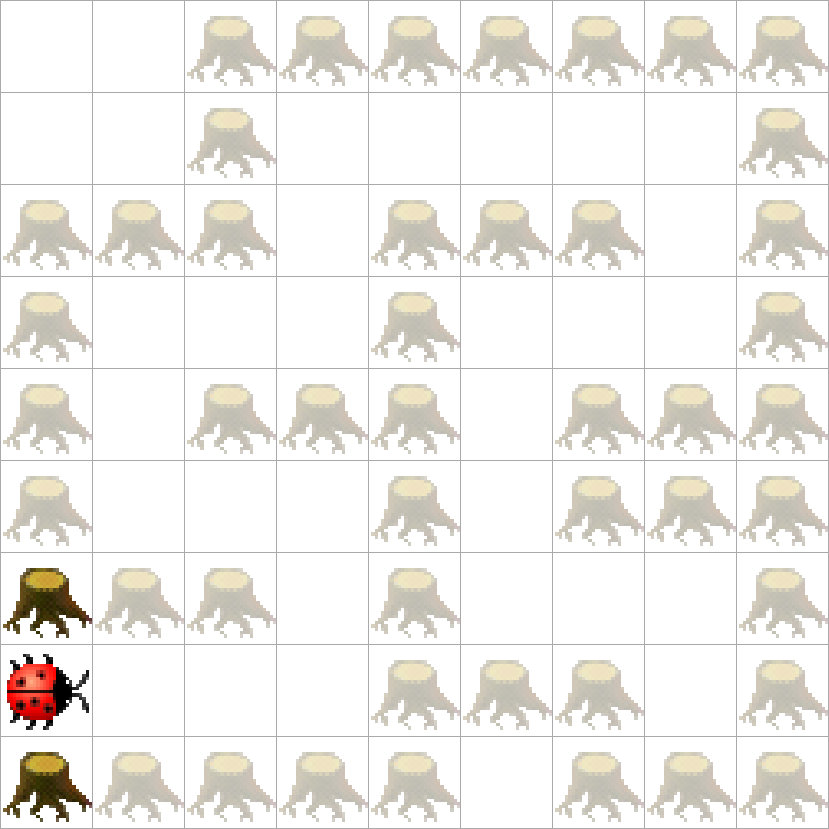

> # Aufgabenstellung
>
> Kara sucht das Ende eines einfachen Labyrinths bestehend aus Bäumen, wobei keine Löcher in den Baumreihen auftreten.
> Das Ende des Labyrinths ist eine „Sackgasse“.
> 

```Java
public void myMainProgram() {
    while (true) {
        if (!kara.treeLeft()) {
            kara.turnLeft();
            kara.move();
        } else if (!kara.treeRight()) {
            kara.turnRight();
            kara.move();
        }
        if (kara.treeFront() && kara.treeLeft() && kara.treeRight()) {
            return;
        }
        kara.move();
    }
}
```
