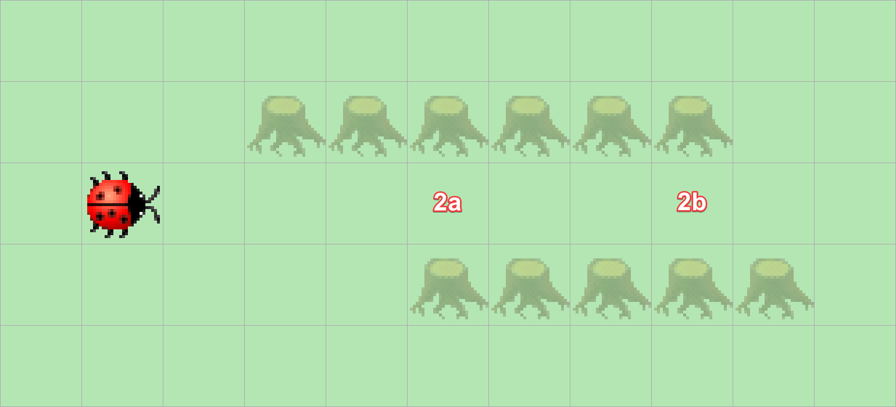

> # Aufgabenstellung
>
> Kara sucht den Eingang eines geraden Tunnels (Feld 2a).
> Schreiben Sie ein Programm, das ihn auf dem ersten Feld im Tunnelinnern anhalten lässt.
> Aber Achtung: manche Tunnels haben zunächst eine einseitige Wand, manche links, manche rechts.
>
> 

Zur Lösung dieses Problems benötigen wir zwei andere Sensoren. Anstelle von `kara.treeFront()` benötigen wir `kara.treeRight()` und `kara.treeLeft()`, diese kombinieren wir wieder mit einer `while`-Schleife, da Kara so lange nach vorne laufen soll, bis er sowohl links als auch rechts von sich einen Baum stehen hat.

Dieses Problem führt auch den logischen UND-Operator ein, der in Java mit `&&` implementiert ist.

```Java
public void myMainProgram() {  
    while (!(kara.treeLeft() && kara.treeRight())) {  
        kara.move();  
    }  
}
```

Ausdrücke (Expressions) befolgen die gleichen Regeln wie die arithmetischen Operatoren in der Mathematik. D.h. hier, dass zuerst der Ausdruck `kara.treeLeft() && kara.treeRight()` evaluiert wird, dieser gibt dann anhand der folgenden Wahrheitstabelle einen Wert zurück, der dann von dem `!`-Operator außerhalb der Klammern negiert wird.

| `kara.treeLeft()` | `kara.treeRight()` | `kara.treeLeft() && kara.treeRight()` | `!(kara.treeLeft() && kara.treeRight())` |
|-------------------|--------------------|---------------------------------------|------------------------------------------|
| `false`           | `false`            | `false`                               | `true`                                   |
| `false`           | `true`             | `false`                               | `true`                                   |
| `true`            | `false`            | `false`                               | `true`                                   |
| `true`            | `true`             | `true`                                | `false`                                  |

Aus dieser Tabelle lässt sich auch gut entnehmen, dass unser Program nur dann hält, wenn Kara am Tunneleingang steht.