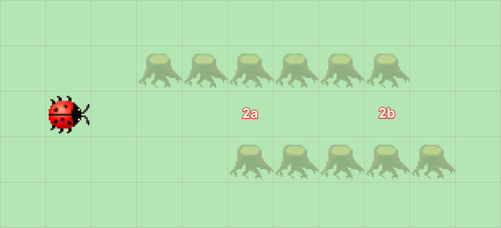

> # Aufgabenstellung
>
> Kara will den Ausgang des Tunnels finden (Feld 2b).
> Dazu muss er zunächst den Tunnel durchqueren.
> Schreiben Sie ein Programm, das ihn auf dem ersten Feld nach dem Tunnel anhalten lässt
> – er soll nicht bis zum Ende der Gallerie laufen!
>
> 

Für dieses Programm muss Kara erstmal in den Tunnel hinein, dafür können wir [den vorherigen Code](II.%20Kara%20der%20Tunnelgräber%20I..md) verwenden. Um dann aus dem Tunnel herauszufinden können wir diesen Code erneut anwenden, jedoch negieren.

```Java
public void myMainProgram() {  
    while (!(kara.treeLeft() && kara.treeRight())) {  
        kara.move();  
    }  
    while (kara.treeLeft() && kara.treeRight()) {  
        kara.move();  
    }  
}
```

> # Hinweis
>
> Viele logische Verbindungen folgen aus der [Aussagenlogik](https://de.wikipedia.org/wiki/Aussagenlogik),
> die mitunter des Morganschen Gesetzes in fast jeder Mathematikvorlesung zur Mengenlehre aufzufinden sind. Da sie die Grundlagen der formalen Sprache bilden.
> Wenn wir `!(kara.treeLeft() && kara.treeRight())` negieren, erhalten wir eigentlich `!(!(kara.treeLeft() && kara.treeRight()))`, dies ist aber gleichwertig mit
> `kara.treeLeft() && kara.treeRight()` da sich doppelte Negationen auflösen, dies lässt sich ebenfalls wieder an einer Wahrheitstabelle trivial ablesen.
>
> | **Bedingung** | **!Bedingung** | **!(!Bedingung)** |
> |---------------|----------------|-------------------|
> | `false`       | `true`         | `false`           |
> | `true`        | `false`        | `true`            |
>
> Wer sich für ein Informatik- oder Mathematikstudium interessiert, sollte sich mit der [Aussagenlogik](https://de.wikipedia.org/wiki/Aussagenlogik) vertraut machen.

