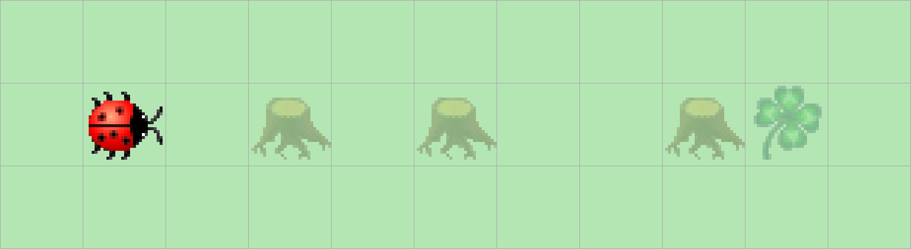

> # Aufgabenstellung
>
> Kara sucht ein Kleeblatt.
> Er weiss, dass eines geradeaus vor ihm liegt - er muss nur um die Bäume herumlaufen.
> Glücklicherweise stehen nie zwei Bäume nebeneinander. 
> Schreiben Sie ein Programm, das ihn bis zum Kleeblatt führt!
>
> 

Diese Aufgabe ist im Vergleich zu den vorherigen schon etwas komplexer, wir benötigen eine Bedingung, die das Programm zu halten bringt, eine Methode mit der wir die Bäume umgehen können und eine Bedingung um diese Methode aufzurufen.

Wir wissen, dass das Ziel erreicht wurde, wenn Kara auf dem Kleeblatt steht, dafür haben wir die Methode `kara.onLeaf()`.

```Java
public void myMainProgram() {  
    while (!kara.onLeaf()) {  
          
    }  
}
```

Wenn ein Baum vor Kara steht, muss dieser umgangen werden, ansonsten muss Kara geradeaus laufen.

```Java
public void myMainProgram() {  
    while (!kara.onLeaf()) {  
        if (kara.treeFront()) {  
            this.bypassTree();  
        } else {  
            kara.move();  
        }  
    }  
}
```

Die `bypassTree()`-Methode besteht aus hartkodierten Anweisungen. Hartkodierung bedeutet, dass eine oder mehrere Anweisungen, Werte oder Definitionen fest in den Programmcode integriert wurden und sich nicht aus einer, vom Code selbst herausgehenden Algorithmik ergeben.

```Java
private void bypassTree() {  
    kara.turnLeft();  
    kara.move();  
    kara.turnRight();  
    kara.move();  
    kara.move();  
    kara.turnRight();  
    kara.move();  
    kara.turnLeft();  
}
```
