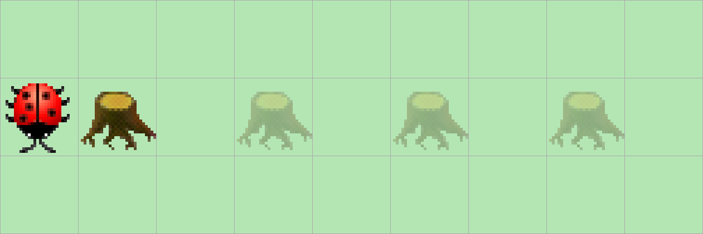

> # Aufgabenstellung
> Kara möchte zwischen den Bäumen Slalom fahren.
> Programmieren Sie Kara so, dass er den Slalom endlos hin- und zurück fährt.
> Am Anfang ist Kara immer so platziert, dass er zuerst eine Linkskurve machen muss.
> Wie lange der Parcour ist (wieviele Bäume der Slalom hat), weiss Kara zu Beginn natürlich nicht.
> Es soll ihm auch egal sein, ob die Bäume horizontal oder vertikal nebeneinander stehen.
>
> 

Um dieses Problem zu lösen, müssen wir die Zustände, in denen sich Kara befinden kann, genau betrachten. Anhand der vorherigen Drehung müssen wir dann entscheiden, ob wir uns nach rechts oder nach links drehen sollen. Um eine Art „Schalter” zu programmieren, der jedes Mal umgeschaltet wird, sobald Kara sich bewegt, eignet sich ein `boolean` am besten, da dieser nur zwei Werte annehmen kann (`true` oder `false`). Unser Hauptprogramm befindet sich wieder in einer Endlosschleife. Wir prüfen zunächst die beiden Zustände, die für das Umkehren im Slalom verantwortlich sind: Steht links neben Kara ein Baum, rechts jedoch nicht, dann drehen wir uns nach links. Steht rechts neben Kara ein Baum, links jedoch nicht, drehen wir uns nach rechts. Solange Kara zwischen zwei Bäumen steht, soll er hin und her laufen.

```Java
public void myMainProgram() {
    boolean lastMoveLeft = false;
    while (true) {
        if (kara.treeLeft() && !kara.treeRight()) {
            this.aroundTreeLeft();
            lastMoveLeft = true;
        } else if (!kara.treeLeft() && kara.treeRight()) {
            this.aroundTreeRight();
            lastMoveLeft = false;
        }
        while (kara.treeLeft() && kara.treeRight()) {
            if (lastMoveLeft) {
                this.aroundTreeRight();
                lastMoveLeft = false;
            } else {
                this.aroundTreeLeft();
                lastMoveLeft = true;
            }
        }
    }
}

private void aroundTreeLeft() {
    kara.move();
    kara.turnLeft();
    kara.move();
    kara.move();
    kara.turnLeft();
    kara.move();
}

private void aroundTreeRight() {
    kara.move();
    kara.turnRight();
    kara.move();
    kara.move();
    kara.turnRight();
    kara.move();
}
```
