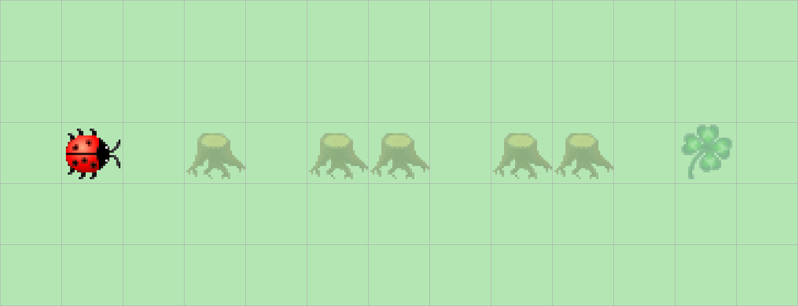

> # Aufgabenstellung
>
> Erweitern Sie Ihr Programm aus [Aufgabe 4](IV.%20Kleeblattsuche%20im%20Wald%20I..md) so, dass Kara auch mit mehreren nebeneinander stehenden Bäumen fertig wird!
>
> 

Hier können wir ebenfalls den Code aus [Aufgabe 4](IV.%20Kleeblattsuche%20im%20Wald%20I..md) als Grundlage verwenden, wir müssen nur die `bypassTree()`-Methode um etwas Logik erweitern.

```Java
private void bypassTree() {  
    kara.turnLeft();  
    kara.move();  
    kara.turnRight();  
    do {  
        kara.move();  
    } while (kara.treeRight());  
    kara.turnRight();  
    kara.move();  
    kara.turnLeft();  
}
```

Hier verwenden wir eine Abwandlung der `while`-Schleife, die `do-while`-Schleife genannt wird, sie ist Fußgesteuert, d.h. die Bedingung ist am Ende der Instruktionen angesiedelt und deshalb werden die Instruktionen auch mindestens einmal ausgeführt, selbst wenn die eigentliche Bedingung nicht erfüllt ist, die `do-while`-Schleife hier ist Äquivalent zu:

```Java
private void bypassTree() {  
    // ...
    kara.move();
    while (kara.treeRight()) {
	    kara.move();
    }
    // ... 
}
```

Die Hauptmethode bleibt unverändert.