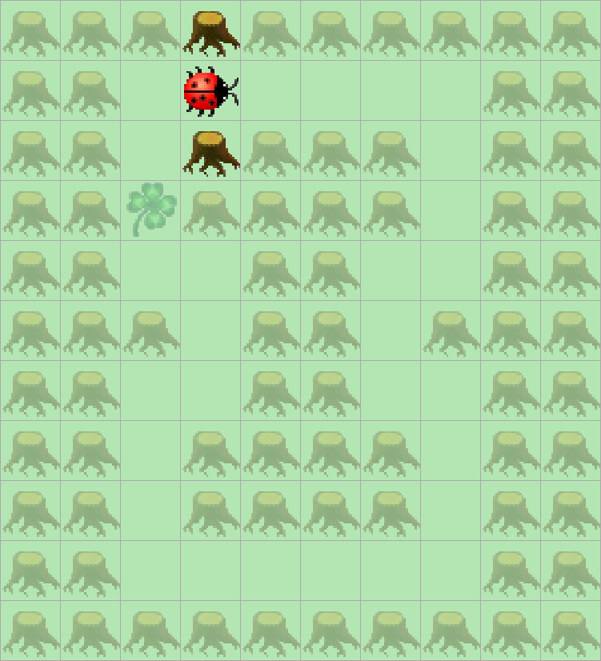

> # Aufgabenstellung
>
> In Karas Welt gibt es Wälder mit Rundgängen, 
> in denen Kara auf Kleeblättersuche geht.
> Jedes Feld in einem Rundgang hat genau zwei freie benachbarte Felder.
> Eines davon liegt hinter Kara, von diesem Feld aus ist auf das aktuelle Feld gekommen.
>
> 

Für diese Aufgaben starten wir wieder mit einer neuen Hauptfunktion, jedoch können wir die Abbruchbedingung beibehalten.

```Java
public void myMainProgram() {  
    while (!kara.onLeaf()) {  
  
    }  
}
```

Um Kara durch diesen "Wald" zu navigieren benötigen wir alle drei Baumsensoren `kara.treeFront()`, `kara.treeRight()` und `kara.treeLeft()`. Anhand der Struktur des Waldes können wir erkennen, dass immer nur einer dieser drei Sensoren den Wert `false` zurückgibt, an diesen können wir uns dann orientieren und Kara dorthin bewegen.

```Java
public void myMainProgram() {  
    while (!kara.onLeaf()) {  
        if (!kara.treeFront()) {
            // Wenn kein Baum vor Kara ist, dann nach vorne bewegen.
            kara.move();  
        } else if (!kara.treeRight()) {
            // Wenn ein Baum vor Kara ist, jedoch kein Baum rechts nebem Kara, dann nach rechts bewegen. 
            kara.turnRight();  
            kara.move();  
        } else {
            // Wenn ein Baum vor Kara und rechts neben Kara ist, dann nach links bewegen.
            kara.turnLeft();  
            kara.move();  
        }  
    }  
}
```
