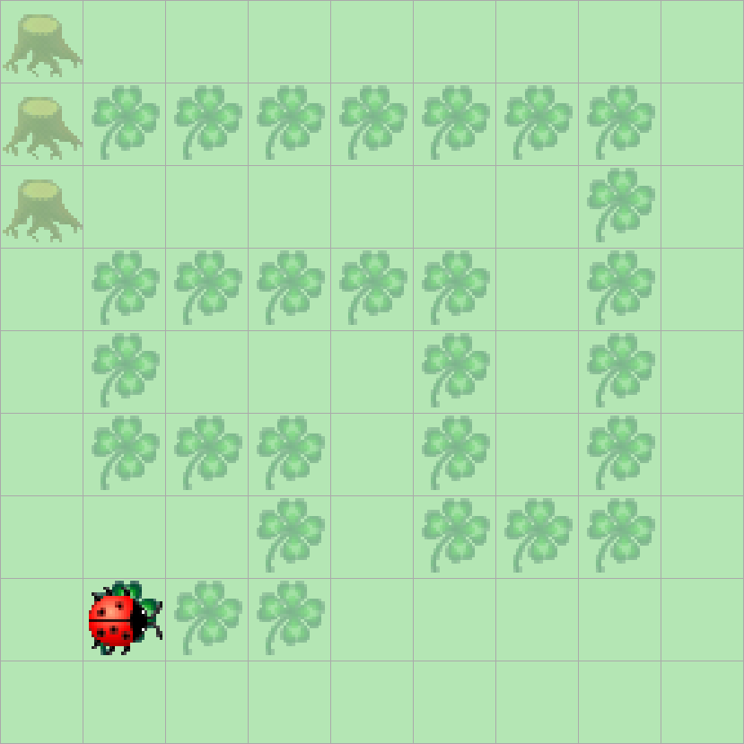
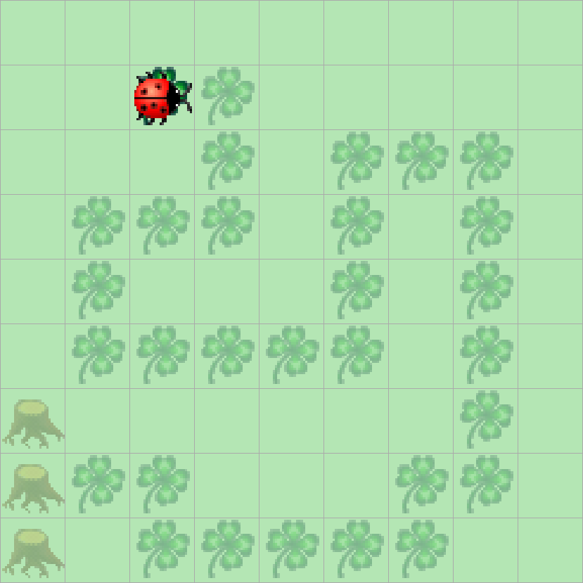

> # Aufgabenstellung
>
> Programmieren Sie Kara so, dass er die Spur von Kleeblättern "auffrisst"!
> Da Sie wissen, dass die Spur nie entlang eines Baumes geht,
> kann das Programm beendet werden, sobald Kara auf einem Kleeblatt vor einem Baum steht.
> Sie können selbst bestimmen, ob Sie auf einem Kleeblatt oder davor starten wollen.
> 
> 
> 

In der Aufgabenstellung wurde uns bereits die Bedingung gegeben, dass das Programm halten soll, sobald Kara vor einem Baum steht, dies können wir als unsere Hauptschleife verwenden.

```Java
public void myMainProgram() {  
    while (!kara.treeFront()) {  
        
    }  
}
```

Innerhalb der Schleife müssen wir nun prüfen ob sich Kara auf einem Blatt befindet, wenn das der Fall ist, dann soll Kara das Blatt aufheben und weiterlaufen.

```Java
public void myMainProgram() {  
    while (!kara.treeFront()) {  
        if (kara.onLeaf()) {  
            kara.removeLeaf();  
            kara.move();
        }
    }
}
```

Falls Kara zu weit läuft und kein Blatt mehr unter Kara liegt, können wir umdrehen und eine andere Route einschlagen.

```Java
public void myMainProgram() {  
    while (!kara.treeFront()) {  
        if (kara.onLeaf()) {  
            kara.removeLeaf();  
            kara.move();  
            if (!kara.onLeaf()) {  
                this.turnAround();
                this.checkSurroundings();
            }
        }
    }
}
```

`turnAround()` ist eine ziemlich selbsterklärende Methode

```Java
private void turnAround() {  
    kara.turnLeft();  
    kara.turnLeft();  
    kara.move();  
}
```

die Magie dieses Algorithmus steckt eher in `checkSurroundings()`, da ich mich entschieden habe ein etwas fortgeschritteneres Konzept der Informatik und Mathematik zu verwenden: Rekursion.

```Java
private void checkSurroundings() {  
    kara.turnRight();  
    kara.move();  
    if (!kara.onLeaf()) {  
        this.turnAround();  
        this.checkSurroundings(); // Rekursiver Methodenaufruf
    }  
}
```

Zunächst bewegt sich Kara wieder nach rechts, dann wird geprüft ob Kara dieses mal auf einem Blatt steht, ist dies wieder nicht der Fall, dreht sich Kara wieder um, geht zurück und ruft die `checkSurroundings()`-Methode aus dem inneren dieser Methode selbst auf.

> # Informelle Definition von Rekursion
> Rekursion ist der Prozess, den eine Prozedur durchläuft,
> wenn einer der Schritte der Prozedur den Aufruf der Prozedur selbst beinhaltet.
> Eine Prozedur, die eine Rekursion durchläuft, wird als „rekursiv“ bezeichnet.
> Ein Beispiel für Rekursion bietet die Fibonacci-Folge, die wie folgt gebildet wird:
> Sei \\( F(0) = 0 \\) und \\(F(1) = 1\\), dann gilt für alle \\(n \in \mathbb{N}\\) mit \\(n > 1\\), dass \\[F(n) = F(n - 1) + F(n - 2)\\]
> Daraus ergibt sich die Folge
> \\[ 0, 1, 1, 2, 3, 5, 8, 13, 21, 34, 55, 89, 144, 233, 377, ... \\]
