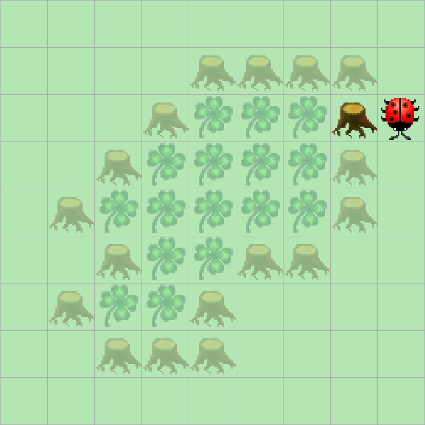

> # Aufgabenstellung
> Kara möchte einen Wald im Uhrzeigersinn patrouillieren.
> Programmieren Sie Kara so, dass er endlos im Uhrzeigersinn um diesen Wald läuft.
> 

Da Kara sich im Uhrzeigersinn bewegen soll, benötigen wir nur `kara.treeFront()` und `kara.treeRight()`.

Da unser Code unendlich lange laufen soll, verwenden wir eine `while-true`-Schleife.

```Java
public void myMainProgram() {  
    while (true) {  
        
    }
}
```

Wir haben zwei Sensoren, die wir prüfen müssen, erstmal

```Java
public void myMainProgram() {  
    while (true) {  
        if (!kara.treeFront()) {  
            
        } else {  
            
        }  
    }  
}
```

und

```Java
public void myMainProgram() {  
    while (true) {  
        if (!kara.treeFront()) {  
            if (kara.treeRight()) {  
                
            } else {  
                
            }  
        } else {  
             
        }  
    }  
}
```

Ich habe mich dazu entschieden, den Code so zu schreiben, anstatt die beiden Bedingungen mit einem logischen UND zu verknüpfen. So ist er lesbarer und es ist einfacher, die einzelnen Pfade nachzuvollziehen. Wenn ein Baum vor Kara steht, drehen wir uns nach links. Steht kein Baum vor Kara, müssen wir zusätzlich prüfen, ob rechts neben Kara ein Baum steht. Steht dort ein Baum, können wir einfach weiterlaufen. Steht dort kein Baum, müssen wir nach rechts gehen.

```Java
public void myMainProgram() {  
    while (true) {  
        if (!kara.treeFront()) {  
            if (kara.treeRight()) {  
                kara.move();  
            } else {  
                kara.turnRight();  
                kara.move();  
            }  
        } else {  
            kara.turnLeft();  
        }  
    }  
}
```

<div class="warning">
Achtung!

Die von den JavaKara-Erstellern vorgeschlagene Lösung für dieses Problem ist falsch und führt in Welt Zwei zu einer Endlosschleife.
</div>

```Java
public void myMainProgram() {  
    while (true) {                                  // laufe endlos den Bäumen entlang  
        if (kara.treeFront() && kara.treeRight()) { // vorne und rechts ein Baum?  
            kara.turnLeft();                        // Linksdrehung!  
        } else if (!kara.treeFront()) {             // vorne kein Baum?  
            if (kara.treeRight()) {                 // rechts ein Baum?  
                kara.move();                        // Schritt vorwärts!  
            } else {                                // rechts kein Baum  
                kara.turnRight();                   // Rechtsdrehung und  
                kara.move();                        // Schritt vorwärts  
            }  
        }  
    }  
}
```
