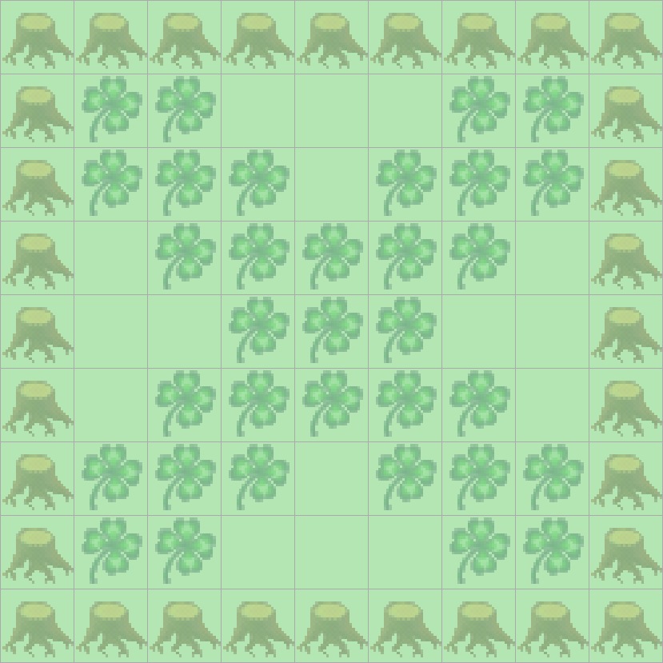

> # Aufgabenstellung
>
> Programmieren Sie Kara so, dass er ein "Negativbild" von dem Kleeblattbild innerhalb des Baumrechtecks erstellt.
> Wo ein Kleeblatt liegt, soll er es aufnehmen, und wo keines liegt, soll er eines hinlegen.
> Kara startet immer oben links in der Ecke mit Blick nach rechts.
>
> 

# TODO! EXPLAIN LATER

```Java
boolean exit = false;

public void myMainProgram() {
    boolean lastSwitchLeft = true;
    while (!exit) {
        if (!kara.treeFront()) {
            this.invert();
            kara.move();
        } else {
            this.invert();
            if (lastSwitchLeft) {
                this.nextRowRight();
                lastSwitchLeft = false;
            } else {
                this.nextRowLeft();
                lastSwitchLeft = true;
            }
        }
    }
}

private void invert() {
    if (kara.onLeaf()) {
        kara.removeLeaf();
    } else {
        kara.putLeaf();
    }
}

private void nextRowRight() {
    kara.turnRight();
    if (kara.treeFront()) {
        exit = true;
        return;
    }
    kara.move();
    kara.turnRight();
}

private void nextRowLeft() {
    kara.turnLeft();
    if (kara.treeFront()) {
    exit = true;
        return;
    }
    kara.move();
    kara.turnLeft();
}
```
