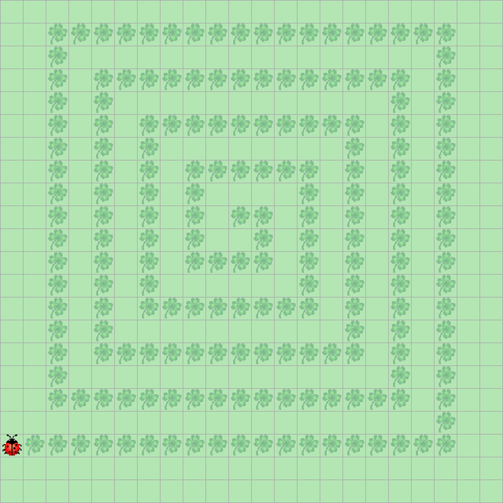

> # Aufgabenstellung
>
> Programmieren Sie Kara so, dass er eine Kleeblatt-Spirale wie die obige zeichnet.
> Von innen nach aussen ist jede Kante der Spirale um eins länger als die vorangehende.
> 
> 

# TODO!

```Java
public void myMainProgram() {
    int counter = 1;
    int limit = 19;
    while (counter <= limit) {
        for (int i = 0; i < counter; i++) {
            kara.putLeaf();
            kara.move();
        }
        kara.turnRight();
        counter++;
    }
}
```