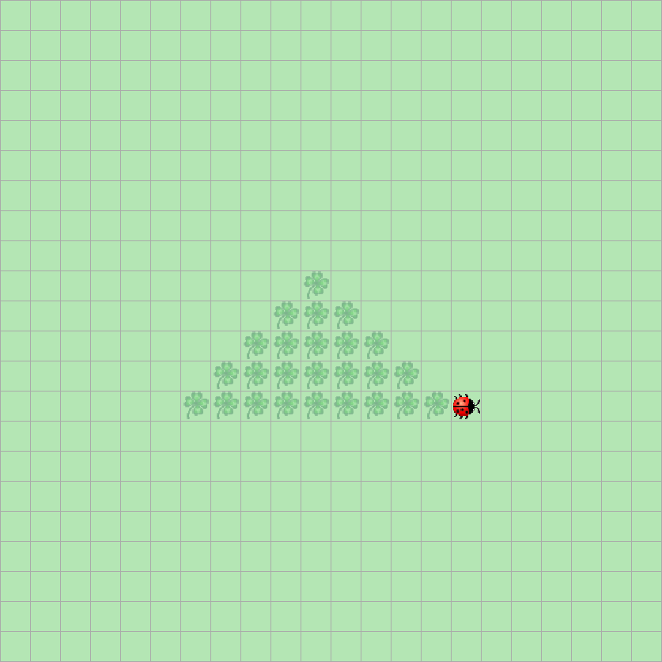

> # Aufgabenstellung
>
> Programmieren Sie Kara so, dass er Dreiecke zeichnet!
> 

**Erklärung der Lösungen zum Zeichnen von Dreiecken**

Kara zeichnet aufsteigende Dreiecke, indem er Blätter in **sich vergrößernden Reihen** platziert. Beide Lösungen nutzen eine Schleifenstruktur, um die Dreiecksform schrittweise aufzubauen, unterscheiden sich aber in der Effizienz der Bewegungen.

---

### **Lösung 1 (Simpel)**  
*Kara bewegt sich in rechteckigen Schleifen und verdoppelt die Schritte pro Ebene.*

```Java
public void myMainProgram() {
    int counter = 1;
    while (counter <= 10) {
        // Zeichnet eine waagerechte Linie mit Blättern
        for (int i = 0; i < counter; i++) {
            kara.putLeaf();
            kara.move();
        }
        // Dreht nach rechts und bewegt sich zur nächsten Reihe
        kara.turnRight();
        kara.move();
        kara.turnRight();
        counter++;
        // Bewegt sich zurück, ohne Blätter zu legen
        for (int i = 0; i < counter; i++) {
            kara.move();
        }
        // Dreht erneut um, um die nächste Linie zu starten
        kara.turnRight();
        kara.turnRight();
        counter++;
    }
}
```

**Schritt-für-Schritt:**  
1. **Waagerechte Linie**: Kara legt `counter`-viele Blätter und bewegt sich vorwärts.  
2. **Rechtsabbiegung**: Dreht nach rechts, bewegt sich eine Position nach oben (neue Reihe).  
3. **Rückweg**: Bewegt sich `counter + 1` Schritte zurück (ohne Blätter).  
4. **Neue Linie vorbereiten**: Dreht um 180°, um in die entgegengesetzte Richtung zu blicken.  
5. **Vergrößerung**: Der `counter` wird pro Schleifendurchlauf **zweimal erhöht**, sodass jede neue Linie länger wird.  

**Effekt:**  
Kara zeichnet ein **rechteckiges Spiralmuster**, das sich zu Dreiecken formt. Die Bewegung ist jedoch nicht optimiert, da er leere Wege zurücklegt (z. B. beim Rückweg ohne Blätter).

---

### **Lösung 2 (Schneller)**  
*Kara nutzt abwechselnde Links-/Rechtsdrehungen, um direkter zur nächsten Reihe zu gelangen.*

```Java
public void myMainProgram() {
    int counter = 1;
    boolean turnedLeft = true;
    while (counter <= 10) {
        // Zeichnet eine waagerechte Linie mit Blättern
        for (int i = 0; i < counter; i++) {
            kara.putLeaf();
            kara.move();
        }
        // Abwechselnd nach rechts oder links drehen
        if (turnedLeft) {
            kara.turnRight();
            kara.move();
            kara.turnRight();
            turnedLeft = false;
        } else {
            kara.turnLeft();
            kara.move();
            kara.turnLeft();
            turnedLeft = true;
        }
        counter += 2; // Größere Sprünge pro Ebene
    }
}
```

**Schritt-für-Schritt:**  
1. **Waagerechte Linie**: Wie in Lösung 1 legt Kara `counter`-viele Blätter.  
2. **Abwechselnde Drehung**:  
   - **Rechtsabbiegung**: Nach der ersten Linie dreht Kara rechts, bewegt sich nach oben, dreht erneut rechts (blickend in die Gegenrichtung).  
   - **Linksabbiegung**: In der nächsten Ebene dreht er links, bewegt sich nach oben, dreht erneut links.  
3. **Effiziente Positionierung**: Durch die alternierenden Drehungen spart Kara leere Rückwege und bewegt sich direkt zur nächsten Startposition.  
4. **Schnelleres Wachstum**: Der `counter` wird pro Durchlauf um **2 erhöht**, was weniger Schleifendurchläufe erfordert.

**Effekt:**  
Kara zeichnet das Dreieck **direkter und schneller**, da er keine redundanten Bewegungen ausführt. Das Muster entsteht durch abwechselndes Rechts-/Links-Wenden, was eine optimierte Pfadführung ermöglicht.

---

### **Gemeinsamkeiten & Unterschiede**  
| Aspekt               | Lösung 1                          | Lösung 2                          |
|----------------------|-----------------------------------|-----------------------------------|
| **Bewegung**         | Immer rechtsdrehend, leere Wege  | Abwechselnd rechts/links, direkt  |
| **Counter-Update**   | +1 pro Teilbewegung (insb. +2)   | +2 pro Schleife                   |
| **Effizienz**        | Langsamer (mehr Schritte)        | Schneller (optimierter Pfad)      |
| **Muster**           | Spiralförmig                     | Direktes Dreieck                  |

**Visualisierung:**  
Stell dir vor, Kara läuft zuerst wie eine Zick-Zack-Linie (Lösung 2) oder eine sich aufblähende Spirale (Lösung 1), wobei jede Linie länger wird, bis das Dreieck vollständig ist.