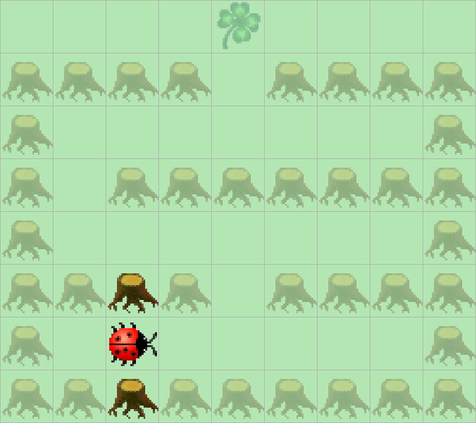

> # Aufgabenstellung
>
> Führen Sie Kara durch das Labyrinth zum Kleeblatt.
> Jede horizontale Baumreihe, ausser der untersten, hat genau einen Ausgang,
> der in die nächst höhere Zeile führt. Diesen muss Kara jeweils finden.
> Hinter dem letzten Ausgang wartet das Kleeblatt auf ihn.
> Programmieren Sie Kara so, dass er das Kleeblatt findet und aufnimmt.
> Dabei soll er nie an einem Ausgang vorbeilaufen, ohne ihn zu benutzen! Zu Beginn schaut Kara immer nach rechts.
>
> 

**Verbesserte Erklärung des Codes:**

Kara navigiert durch das Labyrinth mithilfe der **"Rechte-Hand-Regel"**: Er folgt stets der rechten Wand, um den Ausgang jeder Baumreihe zu finden. Jede horizontale Reihe (außer der untersten) hat genau einen Durchgang zur nächsthöheren Reihe. Der Algorithmus stellt sicher, dass Kara diesen Durchgang nie verpasst und direkt zum Kleeblatt gelangt.

**Schritt-für-Schritt Ablauf:**

1. **Äußere Schleife: Zielerkennung**  
   ```while (!kara.onLeaf())```  
   Die Schleife läuft, bis Kara das Kleeblatt erreicht hat.

2. **Innere Schleife: Rechtswand folgen**  
   ```while (kara.treeRight()) { ... }```  
   Solange rechts ein Baum ist, bewegt sich Kara entlang der rechten Wand:
   - **Blockierter Weg vorne**:  
     Sind **rechts** *und* **vorne** Bäume (Sackgasse), dreht Kara um (```turnRight()``` zweimal → 180°-Wende).
   - **Freier Weg vorne**:  
     Ist nur rechts ein Baum, geht Kara **vorwärts** (```move()```), um der Wand weiter zu folgen.

3. **Rechtsabbiegung: Ausgang finden**  
   ```if (!kara.onLeaf()) { ... }```  
   Sobald **rechts kein Baum** mehr ist (Ausgang zur nächsten Reihe):
   - Kara dreht **nach rechts** (```turnRight()```), um in den Durchgang zu blicken.
   - Er geht **einen Schritt** in den Durchgang (```move()```).  
   Die Prüfung ```!kara.onLeaf()``` verhindert, dass Kara sich nach Erreichen des Ziels unnötig bewegt.

**Warum funktioniert das?**  
- Das Labyrinth ist so konstruiert, dass jede Reihe genau einen Ausgang nach oben hat.  
- Durch das ständige "Rechtshalten" findet Kara garantiert den Durchgang, ohne ihn zu übersehen.  
- Die letzte Bewegung zum Kleeblatt wird durch die Prüfung ```!kara.onLeaf()``` exakt gestoppt.  

**Visualisierung:**  
Stell dir vor, Kara "streicht" mit der rechten Pfote immer an der Wand entlang. Sobald die Wand endet (rechts frei), betritt er die nächste Reihe. So windet er sich systematisch durch das Labyrinth bis zum Ziel.

```Java
public void myMainProgram() {
    while (!kara.onLeaf()) {
        while (kara.treeRight()) {
            if (kara.treeFront()) {
                kara.turnRight();
                kara.turnRight();
            } else {
                kara.move();
            }
        }
        if (!kara.onLeaf()) {
            kara.turnRight();
            kara.move();
        }
    }
}
```
