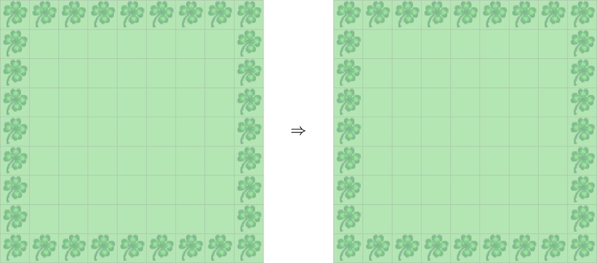
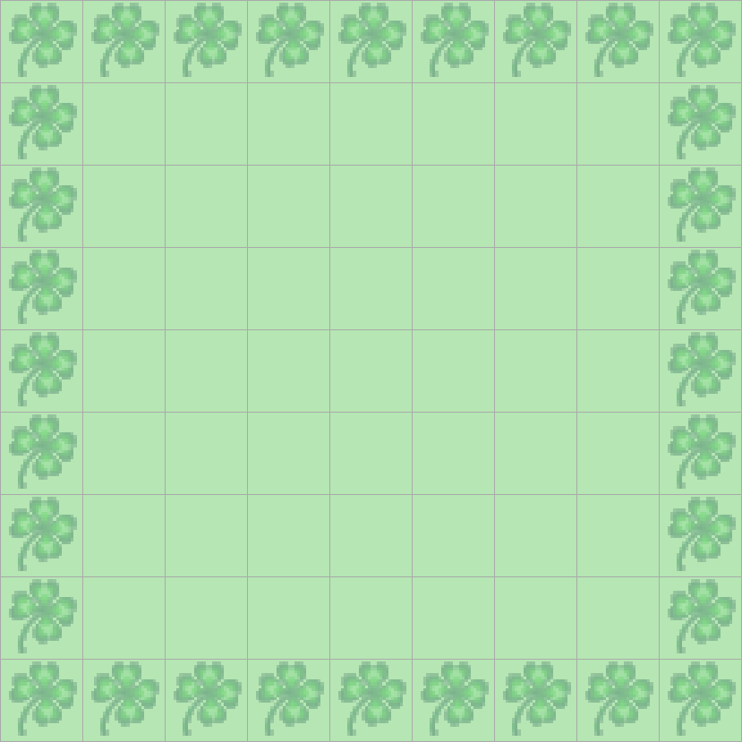

> # Aufgabenstellung
>
> Kara möchte dem "Game of Life" zuschauen. 
> Ausgedacht hat sich dieses "Spiel" der amerikanische Mathematiker Conway.
> Die Regeln sind einfach: Ein Feld in Kara's Welt ist entweder besetzt (Kleeblatt drauf) oder
> unbesetzt (kein Kleeblatt drauf). 
> Die ganze Welt kann man sich als Population von Lebewesen vorstellen,
> aus der sich die nächste Generation nach folgenden Regeln entwickelt:
>
> 1. Ein leeres Feld wird in der nächsten Generation besetzt, 
> wenn es genau drei besetzte Nachbarfelder hat. 
> Beispiel: Das mittlere, leere Feld hat drei besetzte Nachbarfelder und wird daher "geboren":
> 
> 2. Ein besetztes Feld bleibt auch in der nächsten Generation besetzt, wenn es zwei oder drei besetzte Nachbarfelder hat.
> Beispiel: Das mittlere Feld mit Kleeblatt (hell) hat drei besetzte Nachbarfelder und bleibt daher am Leben:
> 
> 3. Alle Felder, bei denen die Voraussetzungen der Regeln 1 und 2 nicht zutreffen,
> sind in der nächsten Generation unbesetzt.
> Beispiel: Das mittlere Feld mit Kleeblatt (hell) hat zu viele besetzte Nachbarfeldern und "stirbt" daher:
> Auch bei relativ einfachen Startwelten (mit vier oder fünf besetzten Feldern) ist es schwierig,
> die Entwicklung der nächsten Generationen vorauszusehen. Man muß sie wirklich durchspielen!
>

> # Hinweis
>
> Auch hier ist der Lösungsansatz der in JavaKara integriert ist, eher suboptimal. Der Code
> - Ignoriert Randzellen (verarbeitet nur innere Zellen von `(1,1)` bis `(SIZE-2, SIZE-2)`).
> Randzellen bleiben für immer in ihrem Ausgangszustand und zerstören die Simulation.
> - Zählt die momentane Zelle selbst und subtrahiert 1, wenn sie noch lebt.
> Obwohl mathematisch gleichwertig, ist dieser Ansatz weniger intuitiv und effizient, als die momentane Zelle von der Berechnung direkt auszuschließen.
> - Initialisierung von Randzellen schlägt fehl, was zu falschen Startbedingungen führt, wenn Ränder Blätter haben.
>
> Dies wird anhand von folgendem Beispiel sehr deutlich
> 
> 
>
> Es sollte jedoch so aussehen:
>
> 
>

Der Code geht davon aus, dass die Kara-Welt nicht kontinuierlich ist, d.h. dass das Feld links von `(0, 0)` anstelle von `(world.getSizeX() - 1, 0)` nicht existiert. Die Ränder der Welt grenzen diese sozusagen vollständig ab, so dass man nicht auf der einen Seite hinausgehen und auf der anderen wieder herauskommen kann. Dies ist jedoch nur meine Annahme, die ich aufgrund der zusätzlichen und unnötigen Komplexität getroffen habe, die ansonsten erforderlich wäre, um dieses *Wrapping*-Verhalten zu implementieren.

Zunächst erstellen wir also einen `boolean`-Array, den wir verwenden um die Daten der einzelnen Zellen zu speichern, ist eine Zelle am Leben (ein Blatt liegt auf diesem Feld), dann ist der Wert für die Koordinaten des Feldes im Array `true`, ansonsten `false`.

```Java
boolean[][] field = new boolean[world.getSizeX()][world.getSizeY()];

for (int x = 0; x < field.length; x++) {
    for (int y = 0; y < field[x].length; y++) {
        // Da world.isLeaf() einen boolean zurückgibt, ist diese Implementierung besonders gut geeignet.
        field[x][y] = world.isLeaf(x, y);
    }
}
```

Die Hauptmethode sollte auch in einer Endlosschleife laufen, dadurch erhalten wir folgenden Code:

```Java
public void myMainProgram() {
    boolean[][] field = new boolean[world.getSizeX()][world.getSizeY()];

    while (true) {
        // Erfassung des aktuellen Zustands
        for (int x = 0; x < field.length; x++) {
            for (int y = 0; y < field[x].length; y++) {
                field[x][y] = world.isLeaf(x, y);
            }
        }
    }
}
```

Da wir nun wissen, wie die jetzige Welt aussieht, können wir anhand dieser die nächste Iteration berechnen. Das ist der komplexe Teil des Programms.

```Java
private boolean[][] updateLife(boolean[][] field) {
    boolean[][] nextIteration = new boolean[field.length][field[0].length];

    for (int x = 0; x < field.length; x++) {
        for (int y = 0; y < field[x].length; y++) {
            int neighbors = countNeighbors(field, x, y);
            nextIteration[x][y] = field[x][y] ? (neighbors == 2 || neighbors == 3) : (neighbors == 3);
        }
    }
    return nextIteration;
}
```

Wir erstellen mit `boolean[][] nextIteration = new boolean[field.length][field[0].length];` wieder einen neuen Array, der die Daten der nächsten Iteration halten soll, ziemlich selbsterklärend. In den darauffolgenden `for`-Schleifen iterieren wir wieder über jedes einzelne Feld, und mit der `countNeighbors()`-Methode zählen wir alle Nachbarn des Feldes mit den Koordinaten `(x, y)`. Zu der Funktion kommen wir gleich.

Zunächst müssen wir noch klären was es sich mit

```Java
nextIteration[x][y] = field[x][y]
    ? (neighbors == 2 || neighbors == 3)
    : (neighbors == 3);
```

auf sich hat. Die `?` und `:` Symbole sind teil des *ternären*-Operators. Die obige Schreibweise ist eine kurzschreibweise für:

```Java
if (field[x][y]) {
    nextIteration[x][y] = (neighbors == 2 || neighbors == 3);
} else {
    nextIteration[x][y] = (neighbors == 3);
}
```

wobei dies auch wieder ausführlicher geschrieben werden kann mit

```Java
if (field[x][y]) {
    if (neighbors == 2 || neighbors == 3) {
        nextIteration[x][y] = true;
    } else {
        nextIteration[x][y] = false;
    }
} else {
    if (neighbors == 3) {
        nextIteration[x][y] = true;
    } else {
        nextIteration[x][y] = false;
    }
}
```

Übrigens, *Ternär* bedeutet einfach, dass der Operator mit drei Werten arbeitet.
Die einfachen arithmetischen Operatoren (`+`, `-`, `*`, `/`) sind alle *binäre* Operatoren, weil sie mit zwei Werten arbeiten.
Und der Negationsoperator `!` ist ein *unärer* Operator.

Diese glorifizierte `if`-Anweisung prüft die Regeln des Spiels des Lebens, die in der Aufgabe definiert sind.

Kommen wir nun zu dem Teil, der in der gegebenen JavaKara-Lösung falsch gemacht wurde. Die Zählung der Nachbarn.

```Java
private int countNeighbors(boolean[][] field, int x, int y) {
    int count = 0;
    int xMin = Math.max(x - 1, 0);
    int xMax = Math.min(x + 1, field.length - 1);
    int yMin = Math.max(y - 1, 0);
    int yMax = Math.min(y + 1, field[0].length - 1);

    for (int i = xMin; i <= xMax; i++) {
        for (int j = yMin; j <= yMax; j++) {
            // Wir schließen i == x und j == y aus, weil wir sonst das Feld prüfen, dessen Nachbarn wir zählen.
            if (field[i][j] && !(i == x && j == y)) {
                count++;
            }
        }
    }
    return count;
}
```

Die `Math.min` und `Math.max` Methoden nehmen zwei Parameter als input und geben je nach Methode den größeren oder kleineren Wert zurück.
- `Math.min(3, 5)` gibt `3` zurück.
- `Math.max(3, 5)` gibt `5` zurück.

```Java
int xMin = Math.max(x - 1, 0);
int xMax = Math.min(x + 1, field.length - 1);
int yMin = Math.max(y - 1, 0);
int yMax = Math.min(y + 1, field[0].length - 1);
```

Wir verwenden diese Methoden, um die Kanten und Ränder der Welt korrekt zu berechnen.
Angenommen, wir wollen die Nachbarn des Feldes `(0, 0)` berechnen, dann wäre `xMin` ohne die obigen Methoden `-1` (gilt auch für `yMin`).
Das würde zu einem Fehler führen, sobald wir ein Blatt auf diese Koordinaten setzen, also setzen wir den Wert wieder auf 0.
Für `(0, 0)` prüfen wir also nur die Felder `(1, 0)`, `(0, 1)` und `(1, 1)`.

Der Rest des Codes ist eigentlich relativ einfach, wir setzen die oben genannten Variablen als unsere Schleifengrenzen und prüfen, ob es ein Blatt auf diesen Feldern gibt, zählen dann den Zähler hoch und ignorieren das Feld, dessen Nachbarn wir zu finden versuchen.

```Java
import javakara.JavaKaraProgram;

public class Main extends JavaKaraProgram {
    private static final int INITIAL_SLEEP_MS = 2000;
    private static final int WAIT_DURATION_MS = 125;

    public static void main(String[] args) {
        new Main().run("F:\\Worlds\\GameOfLife\\WorldOne.world");
    }

    public void myMainProgram() {
        boolean[][] field = new boolean[world.getSizeX()][world.getSizeY()];

        sleep(INITIAL_SLEEP_MS);

        while (true) {
            sleep(WAIT_DURATION_MS);

            // Erfassung des aktuellen Zustands
            for (int x = 0; x < field.length; x++) {
                for (int y = 0; y < field[x].length; y++) {
                    field[x][y] = world.isLeaf(x, y);
                }
            }

            // Berechnung der nächsten Generation
            field = updateLife(field);

            // Weltzustand aktualisieren
            updateField(field);
        }
    }

    private void updateField(boolean[][] field) {
        for (int x = 0; x < field.length; x++) {
            for (int y = 0; y < field[x].length; y++) {
                world.setLeaf(x, y, field[x][y]);
            }
        }
    }

    private boolean[][] updateLife(boolean[][] field) {
        boolean[][] nextIteration = new boolean[field.length][field[0].length];

        for (int x = 0; x < field.length; x++) {
            for (int y = 0; y < field[x].length; y++) {
                int neighbors = countNeighbors(field, x, y);
                nextIteration[x][y] = field[x][y] ? (neighbors == 2 || neighbors == 3) : (neighbors == 3);
            }
        }
        return nextIteration;
    }

    private int countNeighbors(boolean[][] field, int x, int y) {
        int count = 0;
        int xMin = Math.max(x - 1, 0);
        int xMax = Math.min(x + 1, field.length - 1);
        int yMin = Math.max(y - 1, 0);
        int yMax = Math.min(y + 1, field[0].length - 1);

        for (int i = xMin; i <= xMax; i++) {
            for (int j = yMin; j <= yMax; j++) {
                // Wir schließen i == x und j == y aus, weil wir sonst das Feld prüfen, dessen Nachbarn wir zählen.
                if (field[i][j] && !(i == x && j == y)) {
                    count++;
                }
            }
        }
        return count;
    }

    private void sleep(long milliseconds) {
        try {
            Thread.sleep(milliseconds);
        } catch (InterruptedException e) {
            Thread.currentThread().interrupt();
        }
    }
}
```