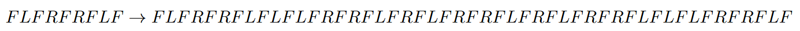
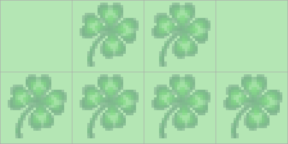
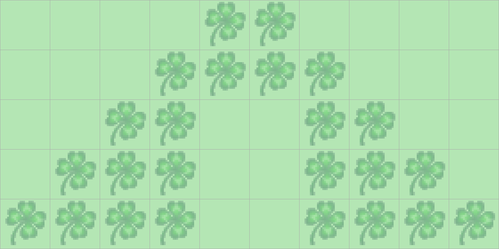
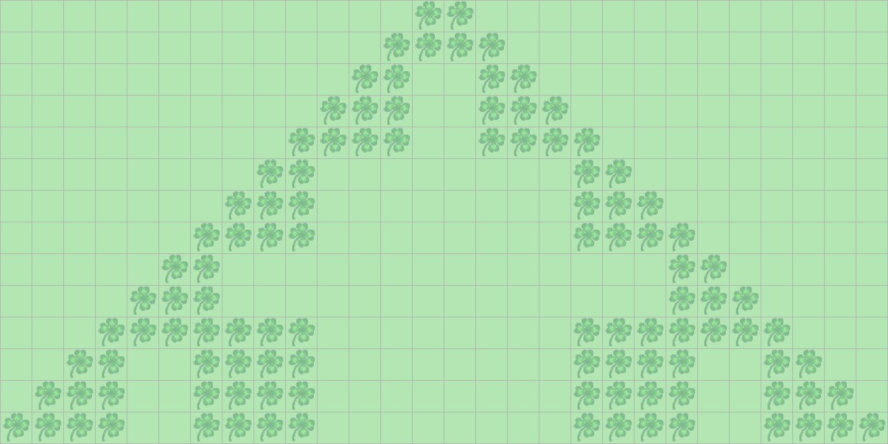
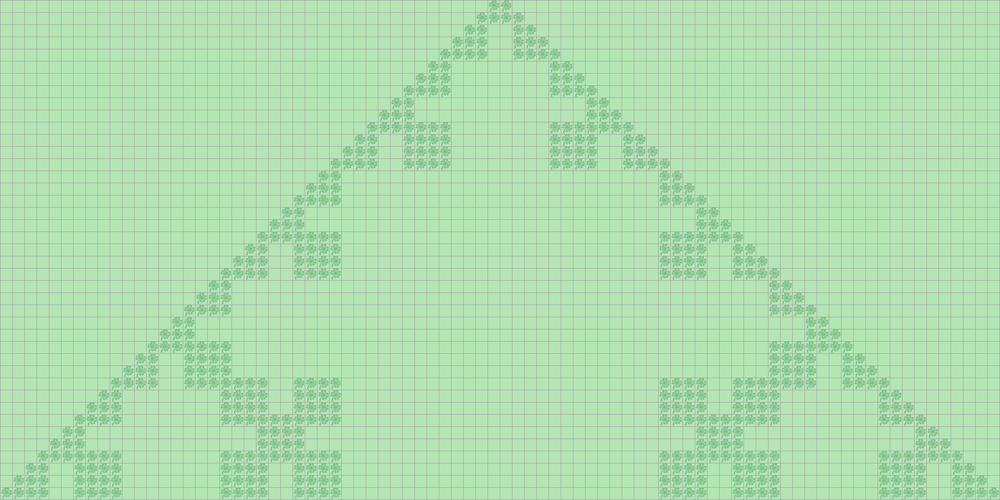

> # Aufgabenstellung
> 
>
> Der Biologe Aristid Lindenmayer wandte kontextfreie Grammatiken an, um das Wachstum von Pflanzen zu beschreiben.
> Wir können in Kara ein einfaches Turtle-Graphiksystem simulieren, mit dem wir einige Beispiele von Lindenmayer-Systemn studieren können.
> Das Turtle-System kenne die Bewegungsbefehle der Kara-Umgebung:
> F für einen Schritt vorwärts sowie L und R für Links- beziehungsweise Rechtsdrehung um 90°.
> Diese drei Befehle können als Alphabet für Lindenmayer-Grammatiken benutzt werden.
> Ein Wort, das aus den Buchstaben dieses Alphabets gebildet wird, ist eine Wegbeschreibung für die Turtle.
> Eine einfache Grammatik besteht beispielsweise lediglich aus der folgenden Ersetzungsregel:
>
> 
>
> Diese Ersetzungsregel wird wiederholt auf ein beliebiges Wort angewendet, das aus den Buchstaben F, L und R besteht.
> Dabei wird jeweils jedes Vorkommen von F entsprechend der Ersetzungsregel ersetzt.
> Betrachten wir als Beispiel, wie die Regel zwei Mal auf das Wort "F" angewendet wird:
>
> 
>
> Die Länge der resultierenden Zeichenkette wächst exponentiell.
> Die Zeichenkette beschreibt eine immer detaillierter werdende Schneeflockenkurve, wie sie in obersten Abbildung dargestellt ist.
> Programmieren Sie Kara so, dass er einfache Lindenmayer-Systeme anwenden und darstellen kann!
> Sie benötigen dazu eine Suche-/Ersetze-Regel, die angibt, wie die Zeichenkette generiert werden soll,
> sowie Wort, das als Ausgangspunkt für die Ersetzungen dient.
> Ihr Programm muss die Ersetze-Regel auf dieses Wort mehrmals anwenden und die dabei entstehende Zeichenkette schliesslich "interpretieren",
> das heisst, die in ihr enthaltenen Befehle durch Kara ausführen lassen.
> 

# TODO! EXPLAIN

## Einfache Lösung (`kara.`-Methoden)

>
> `myMainProgram executed in 1803744 milliseconds`
> `myMainProgram executed in 1803.744 seconds`
> `myMainProgram executed in 30.0624 minutes`
>

```Java
import javakara.JavaKaraProgram;

public class Main extends JavaKaraProgram {
    private static final int DEPTH = 6;
    private static final int WIDTH = 731;
    private static final int HEIGHT = 365;

    public static void main(String[] args) {
        new Main().run();
    }

    public void myMainProgram() {
        world.setSize(WIDTH, HEIGHT);
        kara.setPosition(0, HEIGHT - 1);
        kara.setDirection(3);

        sleep(5000);

        String origin = "F";
        String evolve = "FLFRFRFLF";

        for (int i = 0; i < DEPTH; i++) {
            origin = origin.replaceAll("F", evolve);
        }
        interpret(origin);
    }

    private void interpret(String instructions) {
        kara.putLeaf();
        for (int i = 0; i < instructions.length(); i++) {
            switch (instructions.charAt(i)) {
                case 'F':
                    kara.move();
                    if (!kara.onLeaf()) {
                        kara.putLeaf();
                    }
                    break;
                case 'R':
                    kara.turnRight();
                    break;
                case 'L':
                    kara.turnLeft();
                    break;
                default:
                    break;
            }
        }
    }

    private void sleep(long milliseconds) {
        try {
            Thread.sleep(milliseconds);
        } catch (InterruptedException e) {
            Thread.currentThread().interrupt();
        }
    }
}
```

## Optimierte Lösung

>
> `myMainProgram executed in 4154 milliseconds`
> `myMainProgram executed in 4.154 seconds`
> `myMainProgram executed in 0.069233 minutes`
>

```Java
import javakara.JavaKaraProgram;

public class Main extends JavaKaraProgram {
    private static final int DEPTH = 6;
    private static final int HEIGHT = 365;
    private static final int WIDTH = 2 * HEIGHT;

    public static void main(String[] args) {
        new Main().run();
    }

    public void myMainProgram() {
        world.setSize(WIDTH, HEIGHT);

        sleep(5000);

        String origin = "F";
        String evolve = "FLFRFRFLF";

        for (int i = 0; i < DEPTH; i++) {
            origin = origin.replaceAll("F", evolve);
        }
        interpret(origin);
    }

    private void interpret(String instructions) {
        int x = 0;
        int y = HEIGHT - 1;
        int state = 1;
        world.setLeaf(x, y, true);
        /*
         * 0 → Norden
         * 1 → Osten
         * 2 → Süden
         * 3 → Westen
         */
        for (int i = 0; i < instructions.length(); i++) {
            switch (instructions.charAt(i)) {
                case 'F':
                    switch (state) {
                        case 0:
                            if (y - 1 < 0) {
                                y = HEIGHT - 1;
                            } else {
                                y--;
                            }
                            break;
                        case 1:
                            if (x + 1 > WIDTH - 1) {
                                x = 0;
                            } else {
                                x++;
                            }
                            break;
                        case 2:
                            if (y + 1 > HEIGHT - 1) {
                                y = 0;
                            } else {
                                y++;
                            }
                            break;
                        case 3:
                            if (x - 1 < 0) {
                                x = WIDTH - 1;
                            } else {
                                x--;
                            }
                            break;
                        default:
                            break;
                    }
                    // world.setLeaf wirft keinen Fehler, wenn versucht wird
                    // ein Blatt auf ein Feld zu setzen, auf dem bereits eins ist.
                    world.setLeaf(x, y, true);
                    break;
                case 'R':
                    state = (state + 1) % 4;
                    break;
                case 'L':
                    if (state - 1 < 0) {
                        state = 3;
                    } else {
                        state -= 1;
                    }
                    break;
                default:
                    break;
            }
        }
    }

    private void sleep(long milliseconds) {
        try {
            Thread.sleep(milliseconds);
        } catch (InterruptedException e) {
            Thread.currentThread().interrupt();
        }
    }
}
```

## Gallerie

**Lindenmayer-System mit Tiefe 1**


**Lindenmayer-System mit Tiefe 2**


**Lindenmayer-System mit Tiefe 3**


**Lindenmayer-System mit Tiefe 4**


**Lindenmayer-System mit Tiefe 5**


**Lindenmayer-System mit Tiefe 6**


Eine höhere Tiefe würde außerhalb der maximalen Weltgröße (`1000x1000`) liegen. Schade... 