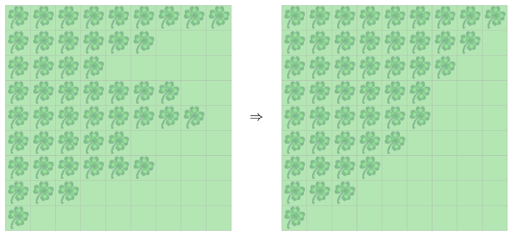

> # Aufgabenstellung
>
> Kara hat etwas gegen Unordnung. 
> Daher beschliesst er, die Balken von Kleeblätter in seiner Welt zu sortieren.
> Ein mögliches Sortierverfahren ist BubbleSort.
> 
> 
> 
> Bubblesort funktioniert wie in der untenstehenden Abbildung dargestellt.
> Man "durchläuft" von oben nach unten die Welt und vergleicht immer zwei "Balken" von Kleeblättern miteinander.
> Wenn der untere kürzer ist als der obere, müssen sie vertauscht werden.
> Wenn zwei Balken vertauscht werden, muss nochmals vorne anfangen werden.
> Erst wenn bei einem Durchlauf aller Balken keine vertauscht werden mussten, sind sie sortiert.
> 

# TODO! EXPLAIN

> # Hinweis
>
> Diese Algorithmus hat eine Zeitkomplexität von \\( O(n^2) \\),
> jegliche Optimisierung die man an diesem Algorithmus vornehmen könnte,
> die nicht die unterliegende Struktur verändert ist nicht relevant und 
> wurde um die Verständlichkeit des Algorithmus zu maximieren, nicht vorgenommen.
>
> Wer einen schnelleren Algorithmus schreiben möchte,
> sollte sich an [QuickSort, MergeSort oder HeapSort](https://en.wikipedia.org/wiki/Sorting_algorithm#Comparison_of_algorithms) wenden.
>


```Java
import javakara.JavaKaraProgram;

public class Main extends JavaKaraProgram {

    public static void main(String[] args) {
        new Main().run("F:\\Worlds\\KleeblattbalkenSortieren\\WorldOne.world");
    }

    public void myMainProgram() {
        sleep(2500);
        while (!isSorted()) {
            for (int y = 0; y < world.getSizeY() - 1; y++) {
                int current = getRowLength(y);
                int next = getRowLength(y + 1);
                if (current < next) {
                    clearRow(y + 1);
                    setRow(next, y);
                    setRow(current, y + 1);
                }
            }
        }
    }

    private void clearRow(int y) {
        for (int x = 0; x < world.getSizeX(); x++) {
            world.setLeaf(x, y, false);
        }
    }

    private void setRow(int x, int y) {
        for (int i = 0; i < x; i++) {
            world.setLeaf(i, y, true);
        }
    }

    private boolean isSorted() {
        for (int y = 0; y < world.getSizeY() - 1; y++) {
            int current = getRowLength(y);
            int next = getRowLength(y + 1);
            if (current > next) {
                return false;
            }
        }
        return true;
    }

    private int getRowLength(int y) {
        int counter = 0;
        for (int x = 0; x < world.getSizeX(); x++) {
            if (world.isLeaf(x, y)) {
                counter++;
            }
        }
        return counter;
    }

    private void sleep(long milliseconds) {
        try {
            Thread.sleep(milliseconds);
        } catch (InterruptedException e) {
            Thread.currentThread().interrupt();
        }
    }
}
```