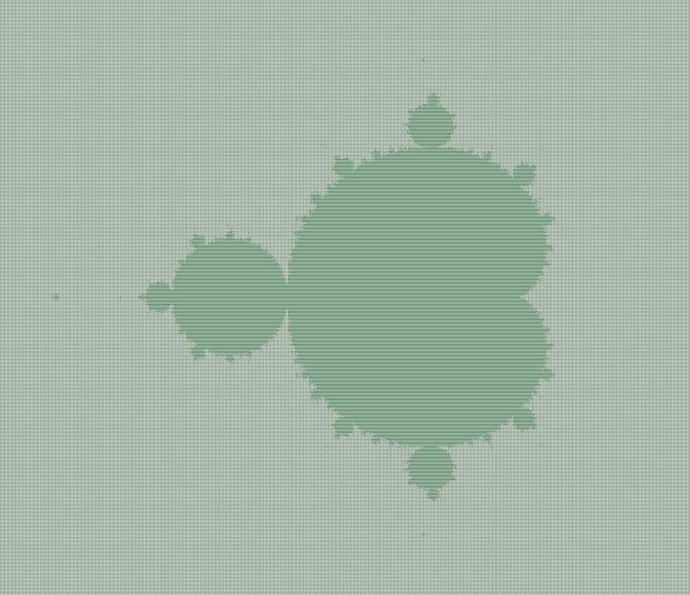

> # Aufgabenstellung
>
> 
>
> Programmieren Sie JavaKara so, dass er ein "zweifarbiges" Mandelbrot-Fraktal zeichnet!
> 
> **Was ist ein Mandelbrot-Fraktal?**
>
> Das Mandelbrot-Fraktal wurde von Benoit Mandelbrot entdeckt; sie repräsentieren die sogenannte Mandelbrot-Menge.
>
> Um erklären zu können, nach welchen Vorschriften eine Mandelbrot-Menge berechnet wird,
> stellen wir uns folgendes vor: 
> Ein Mandelbus startet innerhalb eines Kreises an einem Anfangspunkt und fährt nach bestimmten Vorschriften einer Strecke nach.
>
> Gelangt der Mandelbus auf seiner Fahrstrecke ausserhalb des Kreises,
> so ist die Fahrroute ungültig und diese Fahrstrecke wird eliminiert,
> bleibt der Mandelbus hingegen immer im Kreis, so kann diese "Stecke" als gültig bezeichnet werden.
>
> Die Fahrstrecke besteht aus Punkten.
> Den den aktuellen Anfangspunkt im Kreis bezeichnen wir als \\( (a \mid b) \\).
> Der Mandelbus startet im Punkt \\( (a \mid b) \\) und kommt durch unten dargestellte Berechnung zum nächsten Punkt.
> x und y sind die aktuellen Koordinaten des Mandelbusses, beim Start also a und b.
> \\( (x[\text{neu}] \mid y[\text{neu}]) \\) ist der nächste Punkt, zu dem sich der Mandelbus bewegt.
> Liegt nun einer dieser Punkte nach einer bestimmten Anzahl Berechnungen nicht mehr im Kreis,
> so ist die aktuelle Fahrroute ungültig.
> 
> **Vorgehen für die Berechnung der Punkte in einer Mandelbrot-Menge:**
> 
> Man nehme einen Punkt \\( (a \mid b) \\) innerhalb eines Kreises mit Radius 2 und rechne:
> - \\( x[\text{neu}] = x^2 - y^2 + a \\) für die \\( x \\)-Koordinate des neuen Punktes.
> - \\( y[\text{neu}] = 2 \cdot x \cdot y + b \\) für die \\( y \\)-Koordinate.
> 
> Nun rechne man nach obiger Vorschrift die Fahrstrecke des Mandelbusses.
> Für weitere Stationen des Mandelbusses wird der Punkt \\( (x[\text{neu}] \mid y[\text{neu}]) \\) immer zum aktuellen Punkt \\( (x \mid y) \\).
> So lässt sich dann der nächste Punkt als \\( (x[\text{neu}] \mid y[\text{neu}]) \\) berechnen.
> 
> Diesen Vorgang führen wir für jeden Punkt des Kreises ( = Anfangspunkte) 100 mal durch.
> Wenn nach diesen 100 Iterationen mit dem gewählten Anfangspunkt der aktuelle Punkt \\( (x \mid y) \\)
> nicht aus dem Kreis geraten ist, wird der zuvor gewählte Anfangspunkt eingefärbt.
>
> **Aufgabe**
>
> Schreiben Sie ein Programm, das in Kara's Welt Apfelmännchen zeichnet. Sie können wie folgt vorgehen:
> 1. Schreiben Sie ein Hauptprogramm, das alle Felder in Kara's Welt durchläuft.
> 2. Rechnen Sie dabei für jedes Feld die Koordinaten des Feldes um auf Koordinaten in einem Koordinatensystem mit \\( (x_{\text{min}} = -2, x_{\text{max}} = 2, y_{\text{min}} = -2, y_{\text{max}} = 2) \\).
> 3. Wenden Sie die obige Rechenvorschrift an, um rauszufinden, ob der entsprechende Mandelbus den Kreis mit Radius 2 verlässt oder nicht.
> 4. Falls der Bus den Kreis verlassen hat, legen Sie je ein Kleeblatt auf das entsprechende Feld in Kara's Welt
> 

```Java
import javakara.JavaKaraProgram;

public class Main extends JavaKaraProgram {
    private static final int WIDTH = 500;
    private static final int HEIGHT = 500;
    private static final int ITERATIONS = 100;

    public static void main(String[] args) {
        new Main().run();
    }

    public void myMainProgram() {
        world.setSize(WIDTH, HEIGHT);

        for (int i = 0; i < WIDTH; i++) {
            for (int j = 0; j < HEIGHT; j++) {
                double[] c = getCoordinate(i, j);
                if (isInMandelbrotSet(c[0], c[1])) {
                    world.setLeaf(i, j, true);
                }
            }
        }
    }

    private boolean isInMandelbrotSet(double cx, double cy) {
        double real = 0.0;
        double imag = 0.0;
        for (int i = 0; i < ITERATIONS; i++) {
            double realSq = real * real;
            double imagSq = imag * imag;
            if (realSq + imagSq > 4.0) {
                return false;
            }
            double newReal = realSq - imagSq + cx;
            double newImag = 2 * real * imag + cy;
            real = newReal;
            imag = newImag;
        }
        return true;
    }

    private double[] getCoordinate(int xPixel, int yPixel) {
        double realMin = -2.0;
        double realMax = 1.0;
        double imagMin = -1.5;
        double imagMax = 1.5;

        double cx = realMin + (xPixel / (double) (WIDTH - 1)) * (realMax - realMin);
        double cy = imagMin + ((HEIGHT - 1 - yPixel) / (double) (HEIGHT - 1)) * (imagMax - imagMin);

        return new double[]{cx, cy};
    }
}
```