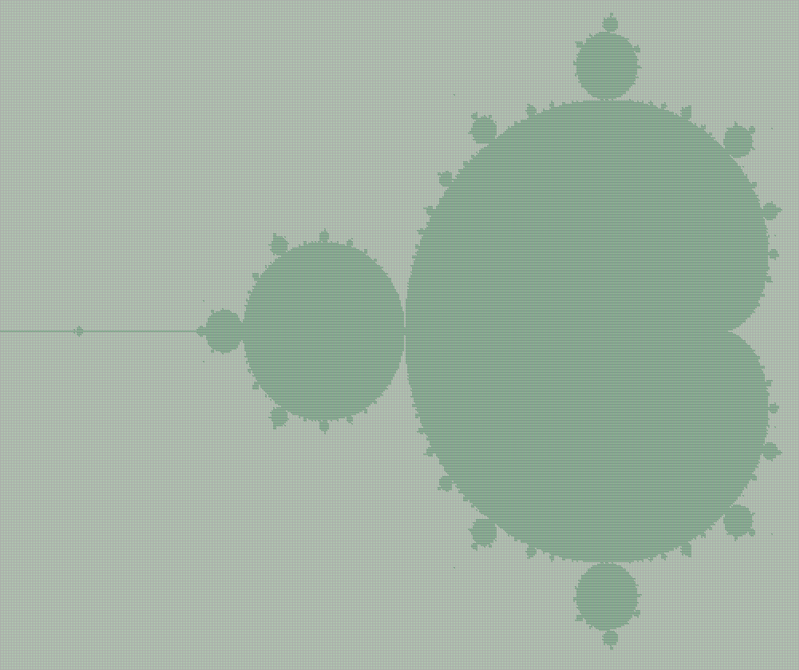

> # Aufgabenstellung
>
> 
>
> Programmieren Sie JavaKara so, dass er ein "zweifarbiges" Mandelbrot-Fraktal zeichnet!
> 
> **Was ist ein Mandelbrot-Fraktal?**
>
> Das Mandelbrot-Fraktal wurde von Benoit Mandelbrot entdeckt; sie repräsentieren die sogenannte Mandelbrot-Menge.
>
> Um erklären zu können, nach welchen Vorschriften eine Mandelbrot-Menge berechnet wird,
> stellen wir uns folgendes vor: 
> Ein Mandelbus startet innerhalb eines Kreises an einem Anfangspunkt und fährt nach bestimmten Vorschriften einer Strecke nach.
>
> Gelangt der Mandelbus auf seiner Fahrstrecke ausserhalb des Kreises,
> so ist die Fahrroute ungültig und diese Fahrstrecke wird eliminiert,
> bleibt der Mandelbus hingegen immer im Kreis, so kann diese "Stecke" als gültig bezeichnet werden.
>
> Die Fahrstrecke besteht aus Punkten.
> Den den aktuellen Anfangspunkt im Kreis bezeichnen wir als \\( (a \mid b) \\).
> Der Mandelbus startet im Punkt \\( (a \mid b) \\) und kommt durch unten dargestellte Berechnung zum nächsten Punkt.
> x und y sind die aktuellen Koordinaten des Mandelbusses, beim Start also a und b.
> \\( (x[\text{neu}] \mid y[\text{neu}]) \\) ist der nächste Punkt, zu dem sich der Mandelbus bewegt.
> Liegt nun einer dieser Punkte nach einer bestimmten Anzahl Berechnungen nicht mehr im Kreis,
> so ist die aktuelle Fahrroute ungültig.
> 
> **Vorgehen für die Berechnung der Punkte in einer Mandelbrot-Menge:**
> 
> Man nehme einen Punkt \\( (a \mid b) \\) innerhalb eines Kreises mit Radius 2 und rechne:
> - \\( x[\text{neu}] = x^2 - y^2 + a \\) für die \\( x \\)-Koordinate des neuen Punktes.
> - \\( y[\text{neu}] = 2 \cdot x \cdot y + b \\) für die \\( y \\)-Koordinate.
> 
> Nun rechne man nach obiger Vorschrift die Fahrstrecke des Mandelbusses.
> Für weitere Stationen des Mandelbusses wird der Punkt \\( (x[\text{neu}] \mid y[\text{neu}]) \\) immer zum aktuellen Punkt \\( (x \mid y) \\).
> So lässt sich dann der nächste Punkt als \\( (x[\text{neu}] \mid y[\text{neu}]) \\) berechnen.
> 
> Diesen Vorgang führen wir für jeden Punkt des Kreises ( = Anfangspunkte) 100 mal durch.
> Wenn nach diesen 100 Iterationen mit dem gewählten Anfangspunkt der aktuelle Punkt \\( (x \mid y) \\)
> nicht aus dem Kreis geraten ist, wird der zuvor gewählte Anfangspunkt eingefärbt.
>
> **Aufgabe**
>
> Schreiben Sie ein Programm, das in Kara's Welt Apfelmännchen zeichnet. Sie können wie folgt vorgehen:
> 1. Schreiben Sie ein Hauptprogramm, das alle Felder in Kara's Welt durchläuft.
> 2. Rechnen Sie dabei für jedes Feld die Koordinaten des Feldes um auf Koordinaten in einem Koordinatensystem mit \\( (x_{\text{min}} = -2, x_{\text{max}} = 2, y_{\text{min}} = -2, y_{\text{max}} = 2) \\).
> 3. Wenden Sie die obige Rechenvorschrift an, um rauszufinden, ob der entsprechende Mandelbus den Kreis mit Radius 2 verlässt oder nicht.
> 4. Falls der Bus den Kreis verlassen hat, legen Sie je ein Kleeblatt auf das entsprechende Feld in Kara's Welt
>

Wenn du es bis hierhin geschafft hast, Herzlichen Glückwunsch! Diese Aufgabe ist mit großem Abstand die schwerste in der Liste der internen JavaKara Aufgaben, selbst mit der gegebenen Hilfestellung der Aufgabenstellung.

Wir können anhand der Auflistung in der Aufgabenstellung jedoch Stückweise vorgehen und unsere Lösung Stück für Stück implementieren. Zunächst müssen wir jedes Feld der Welt durchlaufen, da wir zwei Koordinatenachsen besitzen, lässt sich dies mit einem doppelt genesteten `for`-Loop umsetzen. Wir gehen im äußeren Loop durch alle Spalten und im inneren durch alle Zeilen, die Reihenfolge ist jedoch eigentlich egal.

```Java
public void myMainProgram() {
    // Wir könnten auch eine Welt in der `main`-Methode laden.
    // WIDTH = 200
    // HEIGHT = 200
    world.setSize(WIDTH, HEIGHT);

    for (int i = 0; i < WIDTH; i++) {
        for (int j = 0; j < HEIGHT; j++) {
            
        }
    }
}
```

Als nächstes müssen wir die Koordinaten der Kara-Welt, welche links oben mit `(0, 0)` beginnt und rechts unten mit `(WIDTH, HEIGHT)` endet, in ein zentriertes, kartesisches Koordinatensystem umwandeln.

```Java
private double[] getCoordinate(int xPixel, int yPixel) {
    double realMin = -2.0;
    double realMax = 1.0;
    double imagMin = -1.5;
    double imagMax = 1.5;

    double cx = realMin + ((double) xPixel / WIDTH) * (realMax - realMin);
    double cy = imagMin + ((double) yPixel / HEIGHT) * (imagMax - imagMin);

    return new double[]{cx, cy};
}
```

Beispielrechnung mit den Koordinaten `(0, 0)`:

\\[ cx = -2 + \frac{0}{200} \cdot 3 = -2 \\]
\\[ cy = -1.5 + \frac{0}{200} \cdot 3 = -1.5 \\]

Beispielrechnung mit den Koordinaten `(200, 200)` (Wenn `WIDTH = 200` und `HEIGHT = 200`):

\\[ cx = -2 + \frac{200}{200} \cdot 3 = 1 \\]
\\[ cy = -1.5 + \frac{200}{200} \cdot 3 = 1.5 \\]

Alle Koordinaten der Kara Welt werden somit auf die kartesischen Fläche übertragen. Daraus folgt folgendes Hauptprogramm:

```Java
public void myMainProgram() {
    world.setSize(WIDTH, HEIGHT);

    for (int i = 0; i < WIDTH; i++) {
        for (int j = 0; j < HEIGHT; j++) {
            double[] c = getCoordinate(i, j);
            if (isInMandelbrotSet(c[0], c[1])) {
                world.setLeaf(i, j, true);
            }
        }
    }
}
```

Wir erstellen für jede Iteration der inneren Schleife einen Array, der die kartesischen Koordinaten speichert. Dann prüfen wir ob der Punkt mit diesen Koordinaten nach 100 iterationen divergiert (hier gegen unendlich geht) oder konvergiert (einen festen Wert annimmt).

Die Methode ist wie folgt aufgebaut:

```Java
private boolean isInMandelbrotSet(double cx, double cy) {
    // Hier definieren wir den Real- und Imaginärteil der Koordinate.
    double real = 0.0;
    double imag = 0.0;
    for (int i = 0; i < ITERATIONS; i++) {
        // Wir quadrieren hier beide Komponeten der komplexen Zahl
        double realSq = real * real;
        double imagSq = imag * imag;
        /*
        * Und prüfen ob die Summe davon größer ist als ein gewisser Richtwert (hier 4.0).
        * Wir können diese optimisierung vornehmen, da sich der "Mandelbus" spiralförmig bildet und 
        * wenn der Pfad der Koordinate einen gewissen Wert übersteigt, lässt sich mit sicherheit sagen,
        * dass dieser Wert nicht mehr konvergiert. Das erspart uns bei der Berechnung sehr viele Iterationen.
        */
        if (realSq + imagSq > 4.0) {
            return false;
        }
        /*
        * Hier schreiben wir berechneten Werte für die nächste Iteration auf die alten Variablen.
        * Die Formeln stammen aus der Aufgabenstellung
        * x[neu] = x^2 - y^2 + a
        * y[neu] = 2 * x * y + b
        */
        real = realSq - imagSq + cx;
        imag = 2 * real * imag + cy;
    }
    return true;
}
```

Wenn der "Mandelbus" konvergiert, dann legen wir ein Blatt, wenn nicht, dann nicht.

Das gesammte Programm sieht so aus:

> # Hinweis
>
> Es ist erwünscht mit den Variablen herumzuspielen,
> besonders mit `ITERATIONS`, da die Anzahl der Iterationen bestimmt wie exakt die Mandelbrot-Menge konstruiert wird.

```Java
import javakara.JavaKaraProgram;

public class Main extends JavaKaraProgram {
    private static final int WIDTH = 500;
    private static final int HEIGHT = 500;
    private static final int ITERATIONS = 100;

    public static void main(String[] args) {
        new Main().run();
    }

    public void myMainProgram() {
        world.setSize(WIDTH, HEIGHT);

        for (int i = 0; i < WIDTH; i++) {
            for (int j = 0; j < HEIGHT; j++) {
                double[] c = getCoordinate(i, j);
                if (isInMandelbrotSet(c[0], c[1])) {
                    world.setLeaf(i, j, true);
                }
            }
        }
    }

    private boolean isInMandelbrotSet(double cx, double cy) {
        double real = 0.0;
        double imag = 0.0;
        for (int i = 0; i < ITERATIONS; i++) {
            double realSq = real * real;
            double imagSq = imag * imag;
            if (realSq + imagSq > 4.0) {
                return false;
            }
            real = realSq - imagSq + cx;
            imag = 2 * real * imag + cy;
        }
        return true;
    }

    private double[] getCoordinate(int xPixel, int yPixel) {
        double realMin = -2.0;
        double realMax = 1.0;
        double imagMin = -1.5;
        double imagMax = 1.5;

        double cx = realMin + ((double) xPixel / WIDTH) * (realMax - realMin);
        double cy = imagMin + ((double) yPixel / HEIGHT) * (imagMax - imagMin);

        return new double[]{cx, cy};
    }
}
```